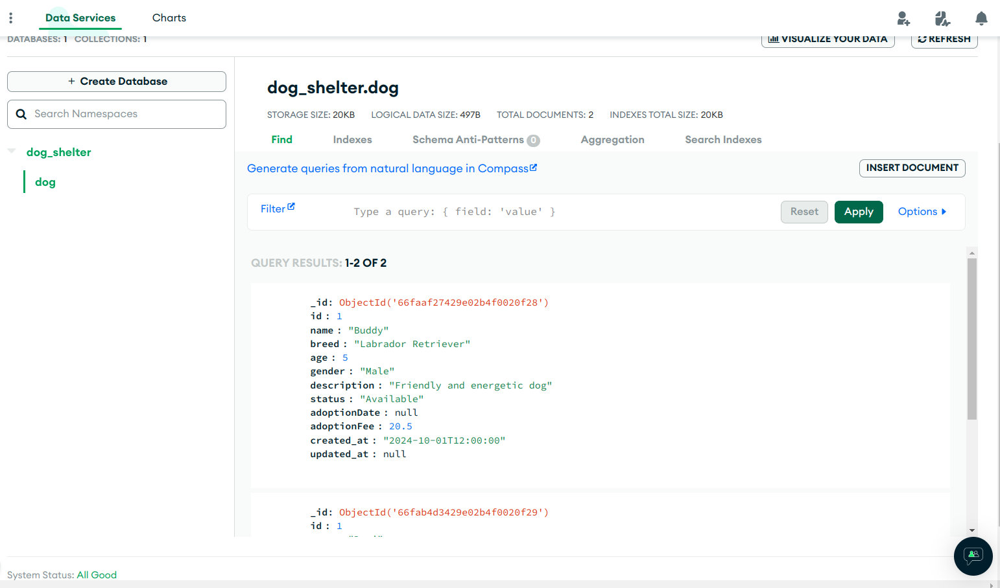

## Basic dog shelter API (for learning purpose) :tm:

> While learning how to build APIs with FastAPI & PyMongo, I came across this [article](https://www.mongodb.com/developer/products/mongodb/8-fastapi-mongodb-best-practices/) which suggested that Mongo driver (which is Async) will be the focus going forward.
>
> So I decided to learn with Motor driver [here](https://github.com/dayo777/car_sales)

This app has a directory of dogs available for adoption, and users can create an account to adopt dogs


### API Endpoints:
> [!NOTE]
> Base endpoint __localhost:8000/api/v1/...__ ,all data is sent/received in JSON format 

> Start the database using the script in the `scripts/` folder

1. [Dog records in the DB](Dog records in the DB) :x:
   - [x] **POST** /dog/ (Create a new dog entry)
   - [ ] **GET** /dog/ (Retrieve a specific dog)
   - [x] **GET** /dog/list/ (List all available active dogs at the shelter)
   - [ ] **DELETE** /dog/delete/ (Remove a dog from the shelter)
   - [ ] **PATCH** /dog/update/ (Update details of a specific dog)

2. [Adoption endpoints for adoption records](/service/README.md) :x:
   - [ ] **POST** /adoption/ (Create a new adoption record)
   - [ ] **GET** /adoption/ (Retrieve details of a specific adoption)
   - [ ] **GET** /adoption/list/ (List all current and past adoptions)
   - [ ] **DELETE** /adoption/delete/ (Cancel an adoption)
   - [ ] **PATCH** /adoption/update/ (Update details of a specific adoption)

3. [Volunteer endpoints for people who adopt the dogs](/service/README.md) :x:
   - [ ] **POST** /volunteer/ (Create a new volunteer record)
   - [ ] **GET** /volunteer/ (Retrieve details of a specific volunteer)
   - [ ] **GET** /volunteer/list/ (List all volunteers)
   - [ ] **DELETE** /volunteer/delete/ (Remove a volunteer)
   - [ ] **PATCH** /volunteer/update/ (Update a volunteer's details)


## JSON data structure
1. Dog Model:
```Json
{
  "id": "123456",
  "name": "Buddy",
  "breed": "Labrador Retriever",
  "age": 5,
  "gender": "Male",
  "size": "Large",
  "color": "Black",
  "description": "Friendly and energetic dog",
  "status": "Available",
  "adoptionDate": null,
  "adoptionFee": 250.00,
  "created_at": 2024-10-01 12:00,
  "updated_at": None
}
```

2. Adoption Model:
```Json
{
  "id": "abc123",
  "dogId": "123456",
  "adopter": {
    "id": "xyz789",
    "name": "Jane Smith",
    "email": "jane.smith@example.com",
    "address": "1, Broad st, San francisco",
    "phone": "555-5678",
    "role": "Dog Walker",
    "startDate": "2022-06-01"
  },
  "adoptionDate": "2023-04-15",
  "status": "Completed"
}
```

3. Volunteer Model:
```Json
{
  "id": "xyz789",
  "name": "Jane Smith",
  "email": "jane.smith@example.com",
  "address": "1, Broad st, San francisco",
  "phone": "555-5678",
  "role": "Dog Walker",
  "startDate": "2022-06-01"
}
```

